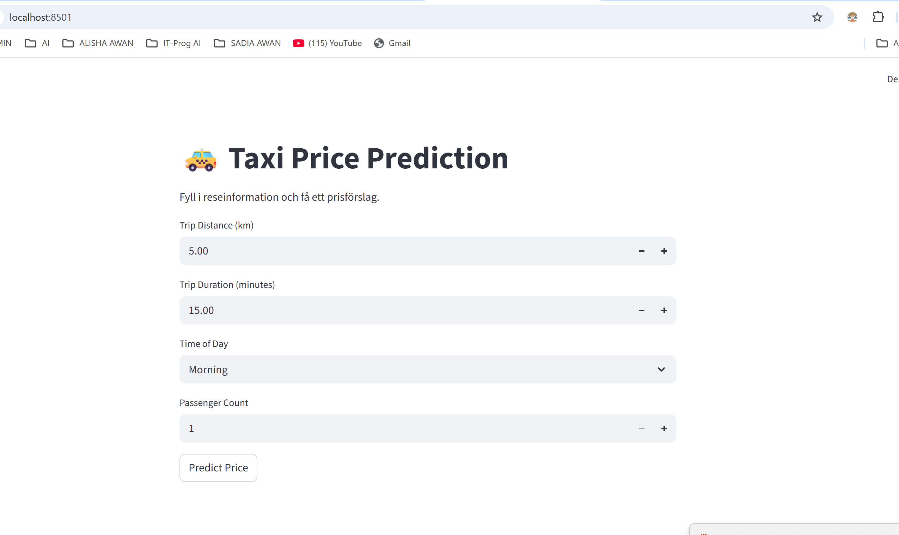
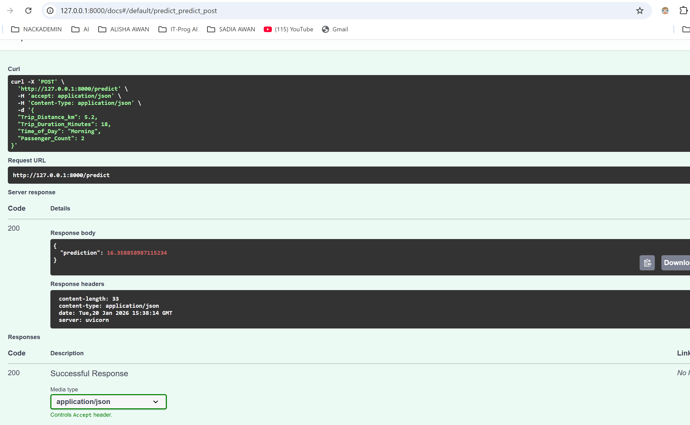
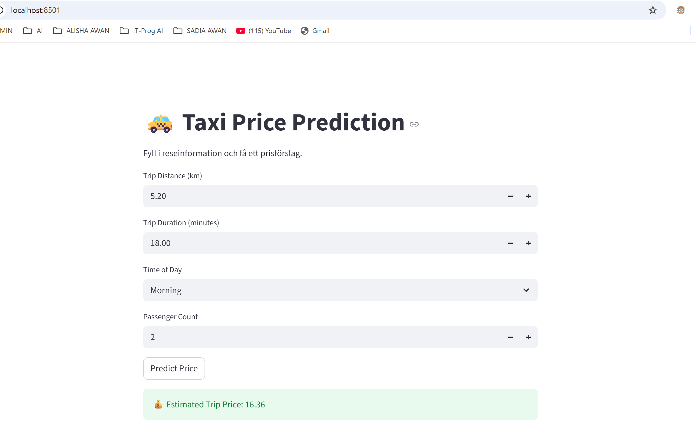

# taxipred_sadia_awan
School lab for ML

Worked with Kevin Bruno my study partner!


Taxi Prediction App:

This project is a full stack machine learning application developed as part of a lab assignment. The purpose of the project is to train a machine learning model for taxi price prediction and deploy it using a backend API and a Streamlit frontend.

The application allows users to enter taxi trip parameters and receive a predicted price generated by a trained regression model.


Project Overview:

The project is divided into three main parts:

Model development: data analysis, preprocessing, and model training

Backend: an API that serves the trained model and handles predictions

Frontend: a Streamlit application that provides a user interface

The project is organized using a modular structure to keep backend, frontend, and utilities separated.


Technologies Used:

Python

Pandas

NumPy

Scikit-learn

FastAPI

Streamlit

DuckDB

Joblib


Project Structure:


```
TAXIPRED_SADIA_AWAN
│
├── .venv/
│
├── src/
│   └── taxipred/
│       ├── __pycache__/
│       │
│       ├── backend/
│       │   ├── api.py
│       │   └── data_processing.py
│       │
│       ├── data/
│       │   └── taxi_trip_pricing.csv
│       │
│       ├── frontend/
│       │   └── app.py
│       │
│       ├── model_development/
│       │   ├── eda.ipynb
│       │   ├── model_dev.ipynb
│       │   ├── test_model.ipynb
│       │   ├── LM_model.joblib
│       │   ├── taxi_cleaned_training_data.csv
│       │   └── taxi_prediction_inputs.csv
│       │
│       ├── utils/
│       │   ├── constants.py
│       │   ├── helpers.py
│       │   └── __init__.py
│
├── .gitignore
├── .python-version
├── pyproject.toml
├── uv.lock
└── README.md
```


Structure Explanation:

backend/ contains the FastAPI backend and data processing logic

data/ contains the raw dataset used for analysis and predictions

frontend/ contains the Streamlit application

model_development/ contains notebooks for EDA, model training, and testing

utils/ contains shared helper functions and constants

This layout cleanly separates data, backend logic, frontend, and model development


Installation and Running the Project:

Follow these steps to run the project on your local machine.

1.Clone the repository

2.Create and activate a virtual environment

python -m venv .venv
source .venv\Scripts\activate


3. Install dependencies

pip install -r requirements.txt


Running the Backend API:

4.Start the backend API by navigating to the backend folder and start the API:

uv run uvicorn api:app --reload

The API will run at:

http://127.0.0.1:8000


5. Start the Streamlit application by starting a new terminal and also navigating to the frontend folder

uv run streamlit run app.py

The Streamlit app will open in your browser at:

http://localhost:8501


Streamlit Application Screenshots:

Below are screenshots from the Streamlit application showing the user interface and prediction flow.


Screenshots Description:

Main page of the Streamlit application

Input form where the user enters trip details

Displayed predicted taxi price

/*************************/


How Screenshots Are Added:

Screenshots are stored in an images folder in the repository and embedded into this README file.

Example:

## Screenshots

### Home Page


### Backend API Documentation


### Prediction Result



/*********************************/


API Endpoints:

The backend exposes the following endpoints:

GET /health
Returns the health status of the API is running

POST /predict
Accepts taxi trip input data and returns a predicted price


Model Development:

Model development and evaluation were performed in Jupyter notebooks located in the model_development folder.
This includes:

Exploratory Data Analysis (EDA)

Data preprocessing

Model training and evaluation

Model testing

The final trained model is saved using Joblib and loaded by the backend API.


Conclusion:

This project demonstrates how to combine machine learning, backend development, and frontend visualization into a complete application. The README provides clear documentation and screenshots to make the project easy to understand and run.
